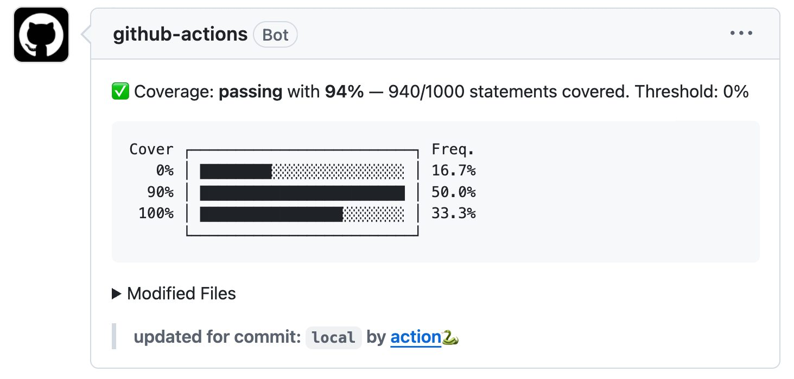

# python coverage action comment

Parse a Python coverage XML report and post a detailed comment on every pull request. Enforces configurable coverage thresholds on all files, new files, and modified files. Includes per file tables (new files/modified files).



**Quick start:** Add a workflow file to `.github/workflows/`:

```yaml
name: coverage
on:
  pull_request:
    branches:
      - main

permissions:
  contents: read       # needed to fetch the commit diff
  pull-requests: write # needed to post and update the PR comment

jobs:
  coverage:
    runs-on: ubuntu-latest
    steps:
      - uses: actions/checkout@v4

      - name: Run tests with coverage
        run: pytest --cov-report xml:coverage.xml --cov=src

      - name: Post coverage comment
        uses: thefastesc/python-coverage-action-comment@v3.4
        with:
          coverageFile: coverage.xml
          token: ${{ secrets.GITHUB_TOKEN }}
```

### Inputs

| Input               | Default         | Description |
|---------------------|-----------------|-------------|
| `coverageFile`      | —               | **required** Path to the coverage XML file produced by `pytest --cov` or `coverage xml`. |
| `token`             | —               | **required** GitHub token used to read the diff and write the PR comment. Use `${{ secrets.GITHUB_TOKEN }}`. |
| `thresholdAll`      | `0.0`           | Minimum acceptable average line coverage across **all** files in the report. Value in `[0, 1]`. |
| `thresholdNew`      | `0.0`           | Minimum acceptable average line coverage across **new** files in the PR. Value in `[0, 1]`. |
| `thresholdModified` | `0.0`           | Minimum acceptable average line coverage across **modified** files in the PR. Value in `[0, 1]`. |
| `sourceDir`         | auto-detected   | Root directory of your source code. Overrides the `<source>` element in the XML report. |
| `passIcon`          | `🟢`            | Icon shown next to files that meet the threshold. |
| `failIcon`          | `🔴`            | Icon shown next to files that do not meet the threshold. |
| `title`             | `Code Coverage` | Heading of the PR comment. Set a unique value per matrix job to post separate comments per job. |
| `postComment`       | `true`          | Post a comment on the PR. Set to `false` to only write the job summary (useful in large matrix workflows) |


### Full example with all inputs

```yaml
name: coverage
on:
  pull_request:
    branches:
      - main

permissions:
  contents: read
  pull-requests: write

jobs:
  coverage:
    runs-on: ubuntu-latest
    steps:
      - uses: actions/checkout@v4

      - name: Run tests with coverage
        run: pytest --cov=src --cov-report xml:coverage.xml

      - name: Post coverage comment
        uses: thefastesc/python-coverage-action-comment@v3.4
        with:
          coverageFile: coverage.xml
          token: ${{ secrets.GITHUB_TOKEN }}
          thresholdAll: 0.8
          thresholdNew: 0.9
          thresholdModified: 0.7
          sourceDir: src
          passIcon: '✅'
          failIcon: '❌'
          title: 'Python Coverage'
```


### Generating a coverage XML report

**pytest-cov**
```bash
pytest --cov=src --cov-report xml:coverage.xml
```

**coverage.py**
```bash
coverage run -m pytest
coverage xml -o coverage.xml
```


### Workflows that run on both push and pull_request

The action only works on pull requests (it needs a PR to comment on). If your workflow also triggers on `push`, guard the action step with a condition:

```yaml
name: coverage
on:
  pull_request:
    branches: [main]
  push:
    branches: [main]

permissions:
  contents: read
  pull-requests: write

jobs:
  coverage:
    runs-on: ubuntu-latest
    steps:
      - uses: actions/checkout@v4

      - name: Run tests with coverage
        run: pytest --cov=src --cov-report xml:coverage.xml

      - name: Post coverage comment
        if: github.event_name == 'pull_request'
        uses: thefastesc/python-coverage-action-comment@v3.4
        with:
          coverageFile: coverage.xml
          token: ${{ secrets.GITHUB_TOKEN }}
```

Without the `if:` guard the step will fail on push events because there is no PR to comment on.

### pytest `--cov-fail-under` vs action thresholds

These are two independent enforcement mechanisms that can be used together:

- **`--cov-fail-under=80`** — pytest fails immediately if overall coverage drops below 80%. The action never runs.
- **`thresholdAll / thresholdNew / thresholdModified`** — the action fails the job and marks which specific files are below threshold in the PR comment.

A common pattern is to use both: `--cov-fail-under` as a hard floor on overall coverage, and the action thresholds for per-PR visibility on new and modified files.

```yaml
      - name: Run tests with coverage
        run: pytest --cov=src --cov-report xml:coverage.xml --cov-fail-under=80

      - name: Post coverage comment
        if: github.event_name == 'pull_request'
        uses: thefastesc/python-coverage-action-comment@v3.4
        with:
          coverageFile: coverage.xml
          token: ${{ secrets.GITHUB_TOKEN }}
          thresholdAll: 0.8
          thresholdNew: 0.9
```

### Matrix builds — one comment per job

For large matrices, consider setting `postComment: false` so each job only writes its own job summary and does not post a PR comment. Each job gets its own summary tab so there is no information loss:

```yaml
      - name: Post coverage comment
        uses: thefastesc/python-coverage-action-comment@v3.4
        with:
          coverageFile: coverage.xml
          token: ${{ secrets.GITHUB_TOKEN }}
          postComment: false
```

If you do want per-job PR comments, set a unique `title` per matrix entry so each job posts its own comment rather than overwriting a shared one:

```yaml
strategy:
  matrix:
    python-version: ['3.11', '3.12']

steps:
  - name: Post coverage comment
    uses: thefastesc/python-coverage-action-comment@v3.4
    with:
      coverageFile: coverage.xml
      token: ${{ secrets.GITHUB_TOKEN }}
      title: "Coverage — Python ${{ matrix.python-version }}"
```

### Permissions

| Permission          | Why it is needed |
|---------------------|------------------|
| `contents: read`    | Fetches the diff between the PR base and head to identify new and modified files. |
| `pull-requests: write` | Creates or updates the coverage comment on the PR. |

If your repository enforces `permissions: read-all` at the org or repo level, set both permissions explicitly in the workflow as shown above.


### Contributing

The action runs from the pre-compiled bundle in `dist/index.js` (see `action.yml: main: dist/index.js`). That file must be rebuilt whenever `src/` changes, otherwise the live action keeps executing old code.

**Locally** — a pre-commit hook handles this automatically. When you commit any change under `src/`, the hook runs `npm run package` and stages the updated `dist/` files before the commit lands.

**In CI** — the `build` job runs `npm run all` (which includes `npm run package`) and then asserts that `dist/` has no uncommitted diff. The job fails if the bundle is out of date.

If you need to rebuild `dist/` manually:
```bash
npm run package
git add dist/
git commit -m "Rebuild dist"
```

To bypass the pre-commit hook in an emergency: `git commit --no-verify`.

### License - [MIT](./LICENSE)

Forked from https://github.com/marketplace/actions/python-coverage. Faster dependency/security updates, better vertical space usage, and additional features.
